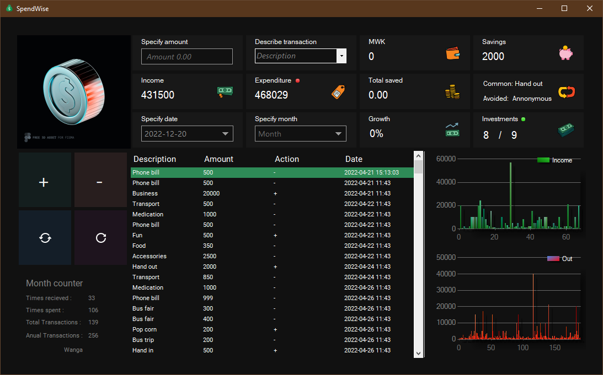
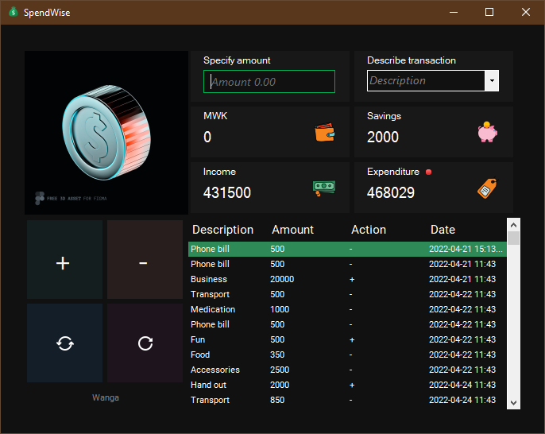
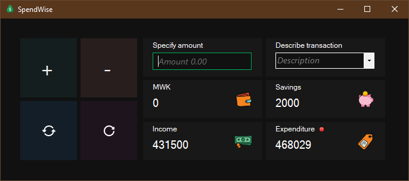

# SpendWise-Virtual-Wallet-C-Sharp

This desktop application is made with dot net C-Sharp and packs a few features that will enable a better understanding of how you spend your money.
It uses basic business formulas to solve mathematical problems you should have been solving to know you financial earnings.

## Main Functions

- 🌱 Calculate Compound Annual Growth Rate (CAGR)
<<<<<<< HEAD
- 💳 Monitor expenditure
=======
- 💳 Monitor expenditure 
>>>>>>> ab6b18e24c80259984de9fc5edaa6ead8fc0cea3
- 💰 Monitor income
- 💸 Track money
- 🐖 Track savings
- 🥅 Track investments
- 💹 Compile annual projection
- 📤 Export transactions

## Other functions

- Set currency
- Set profile picture/motion picture
- Set wallet name
- Set theme Light/Dark mode
- Reset savings
- Reset entire dashboard
- Import database
- Adjustable UI
- Recall UI customization
- Default resolution : 1115, 703

## Features coming

- Manually set savings
- AI generated forecast
- Light theme UI adjustment
- Sticky month selector
- Occurrence monitor

## The main Dashboard

This is the full UI on a generic display, UI may vary depending on screen size and resolution

## The medium Dashboard

This is the UI when partially sized to focus on two programs while spendwise being dominant

## The mini Dashboard

This is the most discreet SpendWise can be without loosing its main functionality and at the same time get out of your way.

